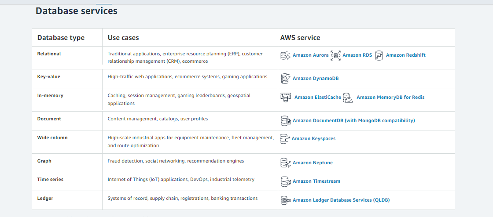

# AWS: Events

##  Describe the similarities between AWS API Gateway + Lambda functions and an ExpressJS Server 

- Express Gateway
Express Gateway plugins are written in JavaScript using the Express.js framework. Express Gateway plugins are analogous to Express middleware, which makes it easy to reuse the prolific JavaScript ecosystem in your API gateway.   
- Amazon API Gateway  
By combining Amazon API Gateway with AWS Lambda, you can build custom logic in JavaScript, Python, Java, or C#. AWS Lambda uses Node.js as its JavaScript runtime, so, like Express Gateway, you can easily leverage npm packages in your API gateway. However, this requires a substantial investment in coding and configuration to get comparable functionality to just a few commands and configuration parameters when extending Express Gateway.

## List the AWS Database offerings and talk about the pros and cons of each

## What’s the difference between a FIFO and a standard queue?

`Standard queues` provide at-least-once delivery, which means that each message is delivered at least once. `FIFO queues ` provide exactly-once processing, which means that each message is delivered once and remains available until a consumer processes it and deletes it.

## How can the server be assured a message was properly received? 

returns a 200 status . 

## Term Definition

`Serverless API`  
  Serverless is a cloud computing execution model where the cloud provider dynamically manages the allocation and provisioning of servers .   

`Triggers`  
Triggers allow you to build applications that will then react to any data modification made in DynamoDB tables. By enabling DynamoDB Streams on a table, you will be able to associate an ARN with your Lambda function. Instantly after an item in the table is modified, a new record will appear in the table’s stream. When AWS Lambda detects a new stream record, it will invoke your Lambda function synchronously.

`Dynamo vs Mongo ` 
Both these databases support multi-document transactions, but with key differences: MongoDB supports read and writes to the same documents and fields in a single database transaction. DynamoDB lacks support for multiple operations within a single transactio

`Dynamoose vs Mongoose` 
- Dynamoose is a modeling tool for Amazon's DynamoDB (inspired by Mongoose).
- Mongoose provides a straight-forward, schema-based solution to model your application data. It includes built-in type casting, validation, query building

# Preview
> Which 3 things had you heard about previously and now have better clarity on?
- DynamoDB
- the cloud
- Standard Queues
> Which 3 things are you hoping to learn more about in the upcoming lecture/demo? 
- Triggers
- Dynamoose/Mongoos
- Dynamo/Mongo
> What are you most excited about trying to implement or see how it works?
-  Cloud Storage 

---------------------------------------------------------------------

## AWS — Difference between SQS and SNS  
SQS and SNS are important components for scalable, large scale, distributed, cloud-based applications:  

- SNS is a distributed publish-subscribe service.
- SQS is distributed queuing service.

### SNS (Simple Notification Service)

 Amazon SNS is a fast, flexible, fully managed push notification service that lets you send individual messages or to bulk messages to large numbers of recipients. Amazon SNS makes it simple and cost effective to send push notifications to mobile device users, email recipients or even send messages to other distributed services. 

 ### SQS (Simple Queue Service)

Amazon SQS is a fully managed message queuing service that enables you to decouple and scale microservices, distributed systems, and serverless applications.
SQS is distributed queuing system. Messages are not pushed to receivers. Receivers have to poll SQS to receive messages. Messages can be stored in SQS for short duration of time (max 14 days).

### Summary
`SQS` is mainly used to decouple applications. `SNS` distributes several copies of message to several subscribers.